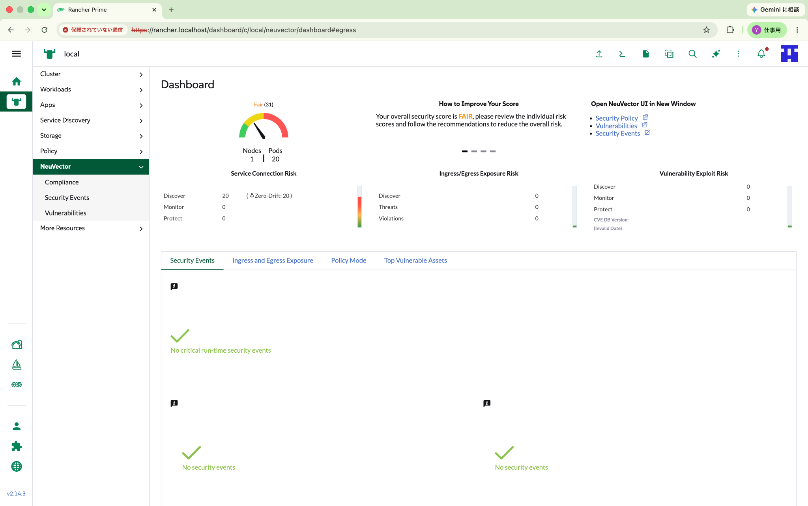
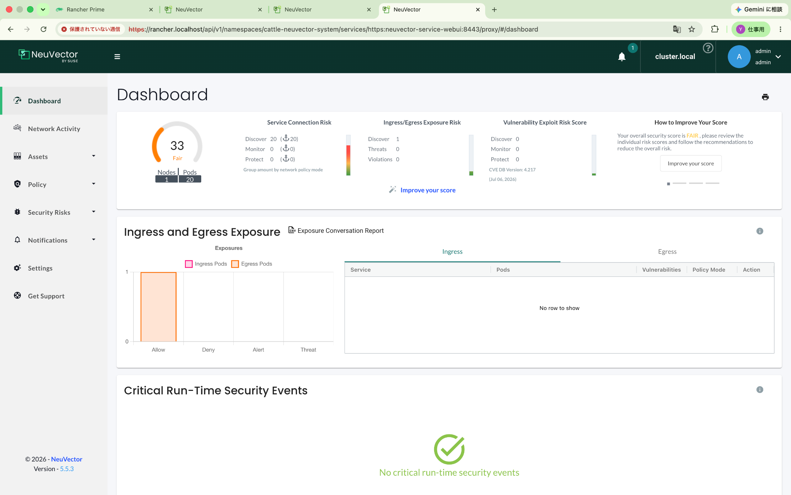

# rancher-prime-neuvector-first-contact

SUSE Rancher Prime に統合された **NeuVector** を、Rancher Desktop 上のローカル Kubernetes 環境で試すための first-contact リポジトリです。

このリポジトリは、単なるインストール手順ではなく、NeuVector を通して **クラウドネイティブ・ランタイムセキュリティ** の基本を理解することを目的にしています。

特に重視しているのは次の点です。

- Rancher Prime Extension と Helm Chart の違いを理解する
- NeuVector の Manager / Controller / Enforcer / Scanner / Updater の役割を理解する
- Rancher Desktop 上で実際に発生した OOMKilled とリソース調整を記録する
- ローカルデモ環境として現実的なリソース設定を残す
- 今後の `rancher-prime-observability-first-contact` や `rancher-prime-admission-controller-first-contact` に接続できる教材にする

## 検証サマリ

| 項目 | 内容 |
|---|---|
| Host | MacBook Pro / Apple M1 Pro / 32GB RAM |
| Rancher Desktop | 1.22.0 |
| Kubernetes | v1.35.6+k3s1 |
| Container Engine | moby / Docker runtime |
| Rancher Prime | v2.14.3 |
| NeuVector UI Extension | 2.1.9 |
| NeuVector Chart | 109.0.3+up2.10.3 |
| NeuVector core image tag | 5.5.3 |
| 初期RD割当 | 6GB / 2CPU |
| 安定化後RD割当 | 16GB / 6CPU |
| 安定化後NeuVector構成 | controller=1, scanner=1, manager=1, enforcer=1 |

## 最終的な成功状態

Rancher Prime 内蔵の NeuVector Dashboard と、NeuVector standalone UI の両方が表示されました。





## 重要な結論

Rancher Desktop の初期設定である **6GB / 2CPU** では、NeuVector のデフォルト構成である `controller.replicas=3` / `cve.scanner.replicas=3` が重く、Manager Pod が `OOMKilled` になりました。

最終的には、以下の変更で安定しました。

```bash
rdctl set --virtual-machine.memory-in-gb 16 --virtual-machine.number-cpus 6
```

Helm values 側では、以下のようにローカル検証向けに軽量化しました。

```yaml
controller:
  replicas: 1

cve:
  scanner:
    replicas: 1
```

この結果、最終的な Kubernetes リソースは次の形になりました。

```text
controller  1/1 Running
manager     1/1 Running
scanner     1/1 Running
enforcer    1/1 Running
```

## ドキュメント構成

| ファイル | 内容 |
|---|---|
| [docs/00-references.md](docs/00-references.md) | 公式参照先 |
| [docs/01-overview.md](docs/01-overview.md) | NeuVector の概要 |
| [docs/02-extension-vs-chart.md](docs/02-extension-vs-chart.md) | Extension と Helm Chart の違い |
| [docs/03-architecture.md](docs/03-architecture.md) | NeuVector アーキテクチャ |
| [docs/04-installation.md](docs/04-installation.md) | Rancher UI からの導入手順 |
| [docs/05-local-resource-tuning.md](docs/05-local-resource-tuning.md) | Rancher Desktop 向けリソース調整 |
| [docs/06-troubleshooting.md](docs/06-troubleshooting.md) | OOMKilled / Bad Gateway / GUI設定不具合の記録 |
| [docs/07-next-steps.md](docs/07-next-steps.md) | 次に試すこと |

## 実行結果・証跡

このリポジトリには、チャット中に取得した実行結果を `outputs/` に、最終的な推奨 values を `manifests/` に、スクリーンショットを `assets/screenshots/` に保存しています。

## 位置づけ

この first-contact は、Rancher Prime を使ったローカル Enterprise Lab の第一歩です。

今後の発展先として、次のリポジトリを想定しています。

- `rancher-prime-observability-first-contact`
- `rancher-prime-admission-controller-first-contact`
- `rancher-prime-platform-first-contact`

NeuVector はこの中で **Protect** の役割を担います。

```text
Protect  : NeuVector
Observe  : Observability
Govern   : Admission Controller / Policy
```
