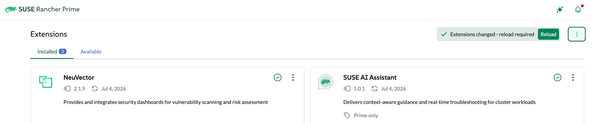
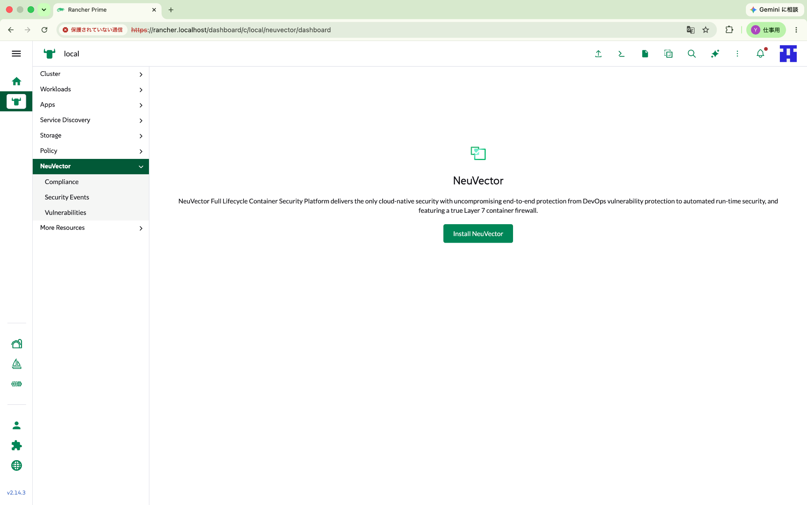

# 02. Rancher Extension と Helm Chart の違い

今回の作業で最初に確認した重要な点は、**NeuVector Extension と NeuVector 本体は別物**だということです。

## Extension を入れた直後

Rancher Prime の Extension 画面から NeuVector Extension を入れると、Rancher UI の左メニューに `NeuVector` が追加されます。



Reload 後、NeuVector メニューは表示されますが、この時点では Kubernetes クラスタ上に NeuVector 本体はまだ存在しません。



この画面は、Extension の役割を理解する上で非常に重要です。

```text
Rancher Prime
  └─ NeuVector Extension
       └─ Rancher UI に NeuVector メニューを追加する

Kubernetes Cluster
  └─ まだ NeuVector 本体はない
```

## Helm Chart を入れた後

`Install NeuVector` を押すと、Rancher Apps の Helm Chart インストールフローに進みます。

この Chart によって、Kubernetes クラスタ上に以下のような実体が作られます。

- Manager
- Controller
- Enforcer
- Scanner
- Updater
- Services
- Admission Webhooks
- CRDs

## 比較表

| 項目 | NeuVector Extension | NeuVector Helm Chart |
|---|---|---|
| 主な役割 | Rancher UI の拡張 | NeuVector 本体のデプロイ |
| インストール先 | Rancher Manager / UI Plugin | Kubernetes Cluster |
| Podを作るか | 基本的には本体Podは作らない | 作る |
| 失敗時の症状 | メニューが出ない | Dashboard 503 / Manager OOMKilled など |
| 今回のバージョン | 2.1.9 | 109.0.3+up2.10.3 |

## 学び

Rancher Prime の Extension は「機能本体」ではなく、「管理体験を Rancher UI に統合する入口」です。実際の機能は、多くの場合 Helm Chart として Kubernetes クラスタ上にデプロイされます。
