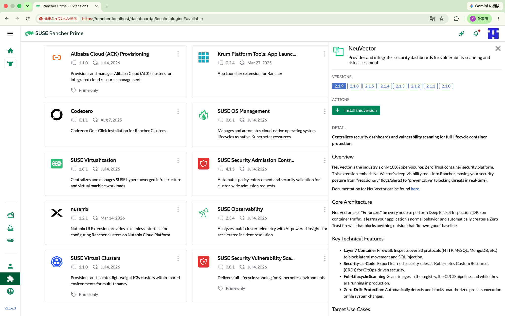
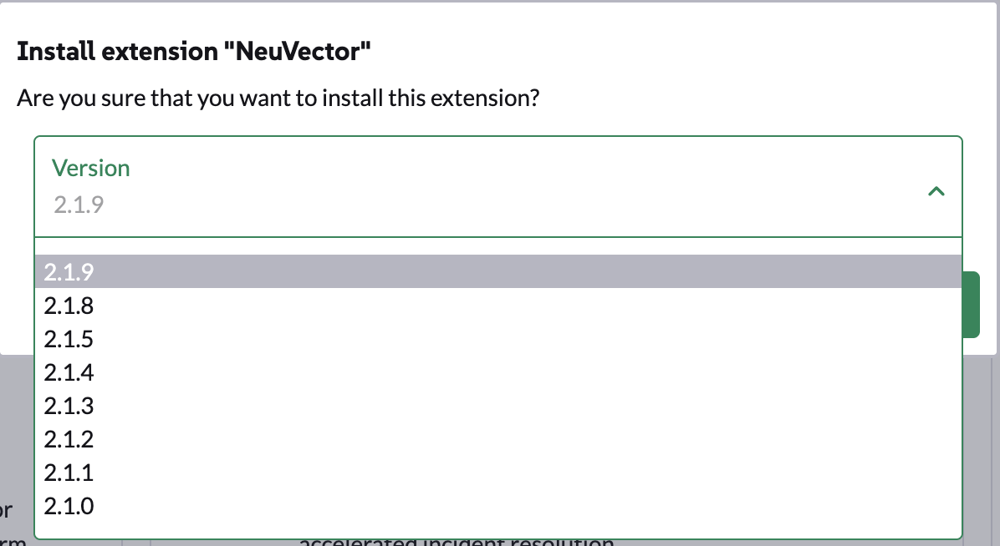
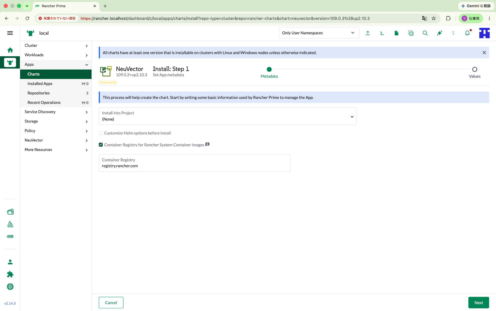
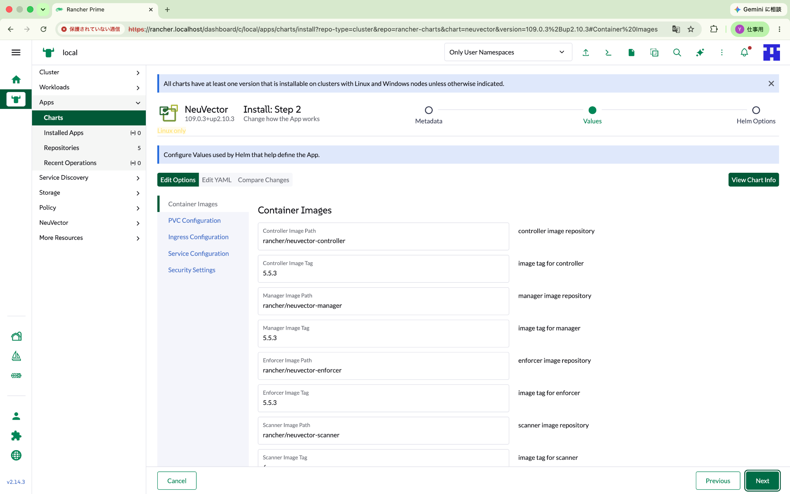
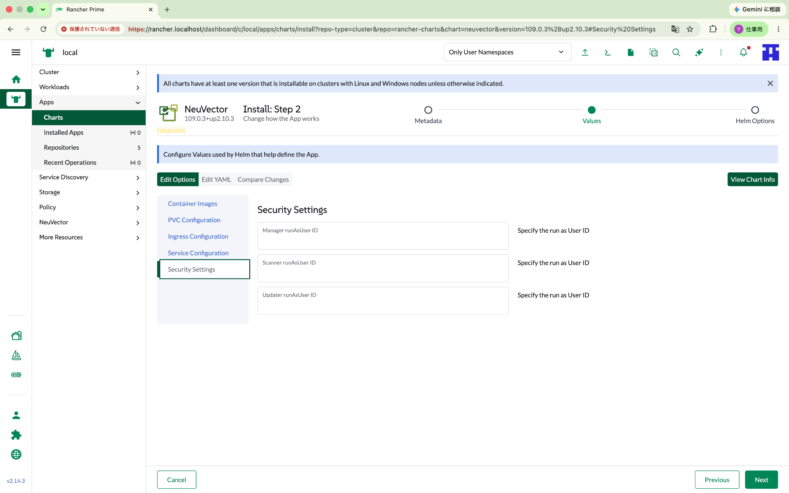
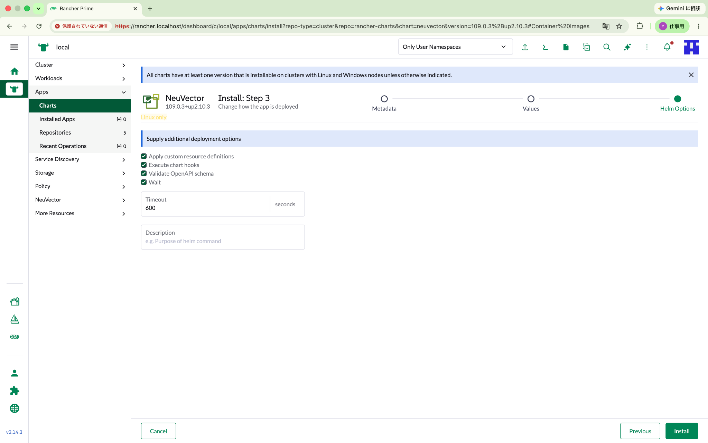
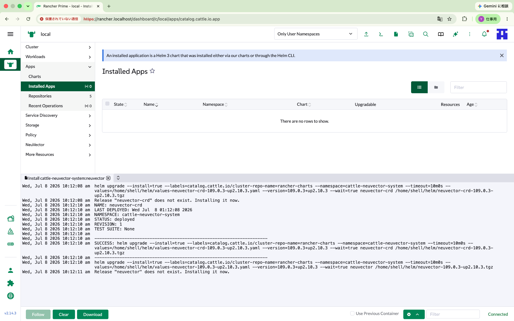
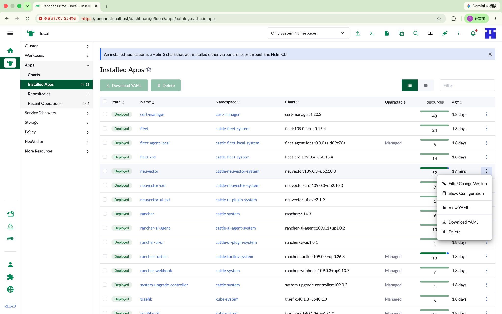

# 04. Installation Notes

この章では、Rancher Prime UI から NeuVector をインストールした流れを記録します。

## 1. NeuVector Extension のインストール

Rancher Prime の `Extensions` 画面で NeuVector を選択します。



Version `2.1.9` を選択してインストールしました。



インストール後、UI reload が必要になります。


## 2. NeuVector 本体のインストール

Extension の導入後、左メニューに NeuVector が表示されます。ただし、この時点では本体はまだありません。


`Install NeuVector` を押すと、Helm Chart のインストール画面に進みます。

### Step 1: Metadata



今回の Chart は以下でした。

```text
Chart Version: 109.0.3+up2.10.3
NeuVector core image tag: 5.5.3
```

### Step 2: Values

Container images 画面では、Controller / Manager / Enforcer / Scanner / Updater のイメージが確認できます。



Security Settings では、Manager / Scanner / Updater の runAsUser などが確認できます。



### Step 3: Helm Options



`Apply custom resource definitions` が有効になっており、CRD が先にインストールされます。

## 3. CRD と本体の2段階インストール

インストールログから、以下の順番で処理されることが分かりました。

```text
1. neuvector-crd をインストール
2. neuvector 本体をインストール
```



これは Kubernetes における典型的なパターンです。Operator やセキュリティ製品では、先に CustomResourceDefinition を登録し、その後に本体リソースをデプロイすることがよくあります。

## 4. Installed Apps の表示条件

NeuVector は `cattle-neuvector-system` namespace にインストールされます。

Rancher UI の Apps > Installed Apps で `Only User Namespaces` のままだと見えません。`Only System Namespaces` に切り替えると表示されます。


