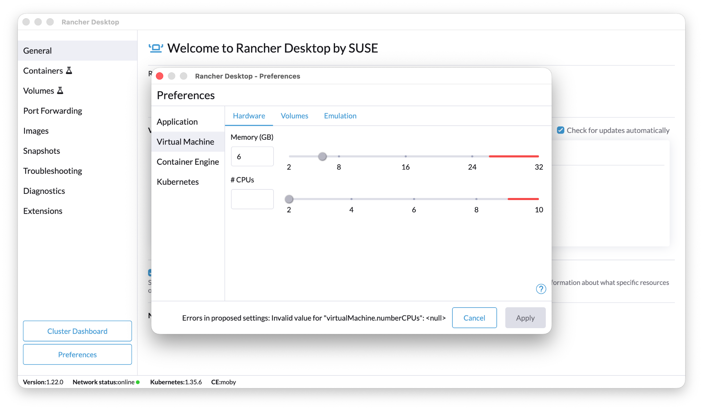
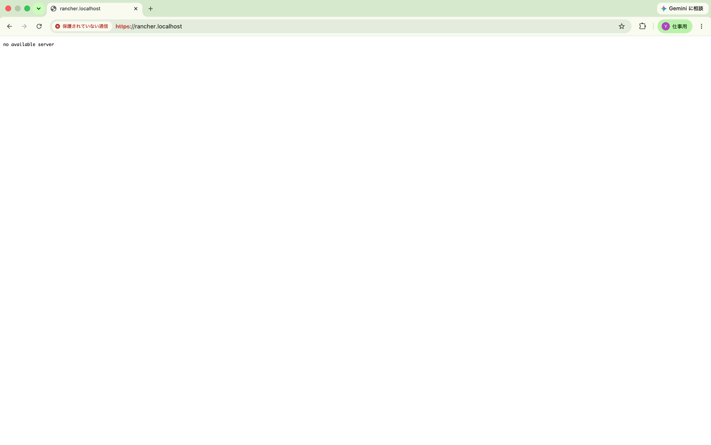

# 06. Troubleshooting Log

この章では、実際に発生したトラブルと対応を記録します。

## 1. Rancher Desktop GUI の CPU 設定が `<null>` になる

Rancher Desktop v1.22.0 の Preferences > Virtual Machine で CPU 数を変更しようとすると、以下のエラーになりました。

```text
Errors in proposed settings: Invalid value for "virtualMachine.numberCPUs": <null>
```



`rdctl list-settings` では `numberCPUs: 2` と正常に表示されていたため、設定ファイルではなく GUI 側の問題と判断しました。

対応として、CLI から以下を実行しました。

```bash
rdctl set --virtual-machine.memory-in-gb 16 --virtual-machine.number-cpus 6
```

## 2. Manager Pod が OOMKilled になる

NeuVector のデフォルト構成では、Manager Pod が OOMKilled になりました。

```text
Last State: Terminated
Reason: OOMKilled
Exit Code: 137
QoS Class: BestEffort
```

ログ上は Manager が一度起動していました。

```text
Server is listening on :8443
```

しかし、直後にメモリ不足で落ちていました。

## 3. Dashboard 503 / Bad Gateway

Manager Pod が Ready でない場合、Rancher の NeuVector Extension 画面では以下のようなエラーになりました。

```text
no endpoints available for service "https:neuvector-service-webui:8443"
```

また、別のタイミングでは `Bad Gateway` も表示されました。

この場合、Extension ではなく Manager Pod の状態を確認します。

```bash
kubectl get pods -n cattle-neuvector-system
kubectl describe pod <manager-pod> -n cattle-neuvector-system
kubectl logs <manager-pod> -n cattle-neuvector-system --previous
```

## 4. API Server TLS handshake timeout

6GB / 2CPU のまま NeuVector の upgrade を行うと、旧 Pod と新 Pod が重複してメモリ不足になり、kubectl も以下のように詰まりました。

```text
Unable to connect to the server: net/http: TLS handshake timeout
```

Rancher UI も一時的に以下のようになりました。



この段階では、無理に kubectl で復旧し続けるよりも、Rancher Desktop VM のリソース増加を優先した方が安全です。

## 5. 緊急スケールダウン

一時的に環境を救うため、以下のように Deployment をスケールダウンしました。

```bash
kubectl scale deployment neuvector-controller-pod   -n cattle-neuvector-system   --replicas=1

kubectl scale deployment neuvector-scanner-pod   -n cattle-neuvector-system   --replicas=1
```

ただし、これは Helm values の恒久変更ではありません。最終的には Rancher Apps の Edit / Change Version から values を変更し、Helm に反映しました。

## 6. Helm values と kubectl scale の違い

`kubectl scale` は応急処置には便利ですが、Helm 管理下のリソースでは恒久的な設定ではありません。

恒久化するには、Rancher Apps から values を変更するか、Helm upgrade で values を指定する必要があります。

今回の最終方針は以下です。

```yaml
controller:
  replicas: 1

cve:
  scanner:
    replicas: 1
```
