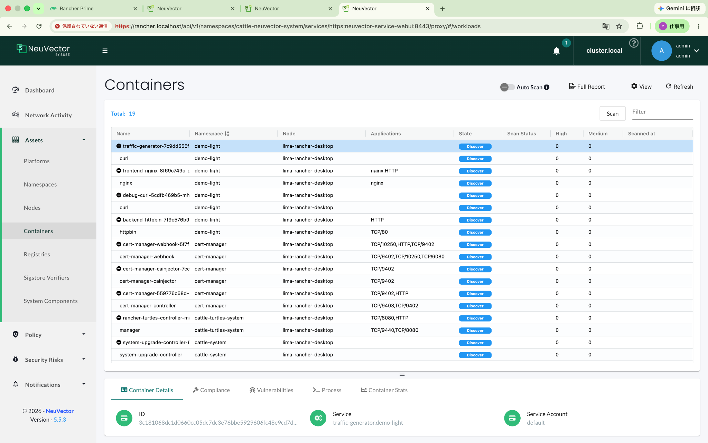
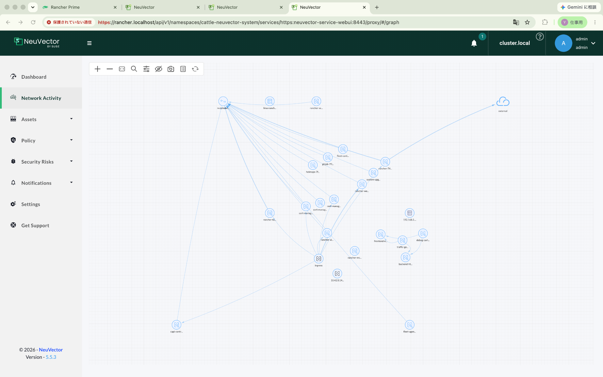
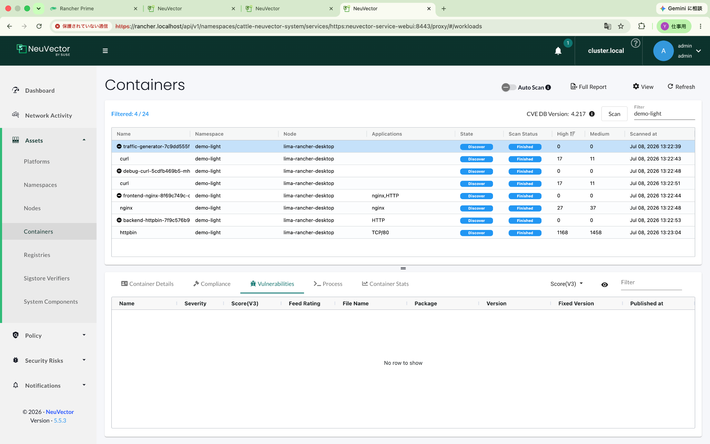
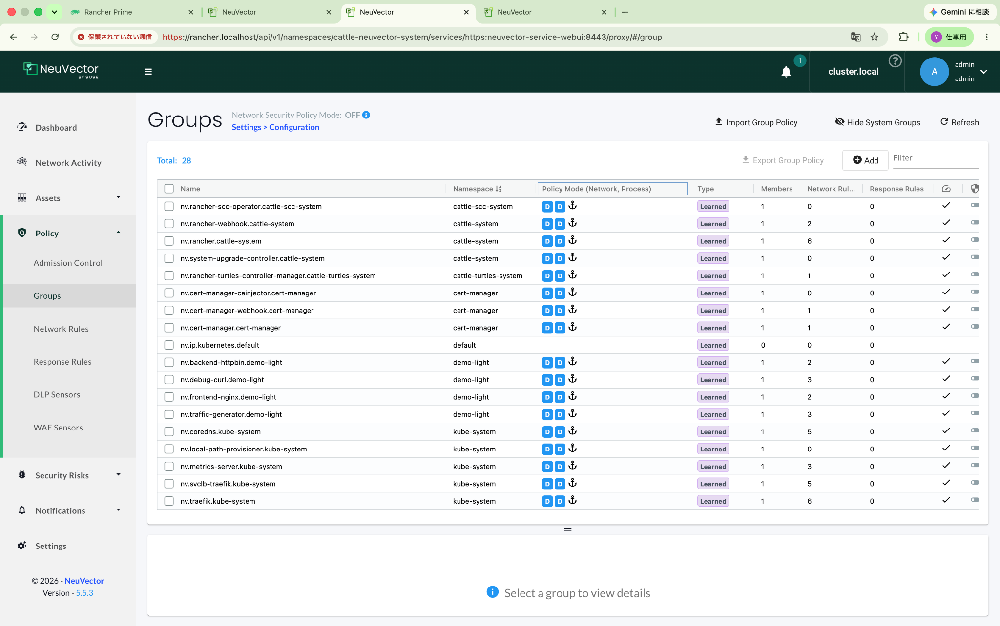
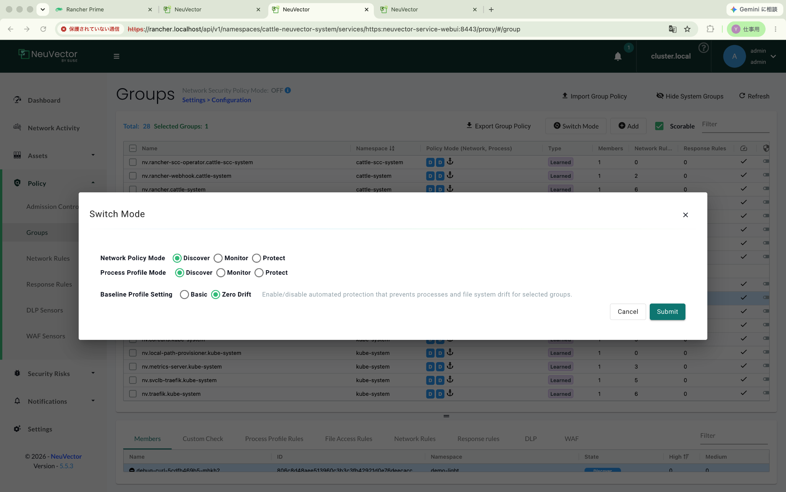
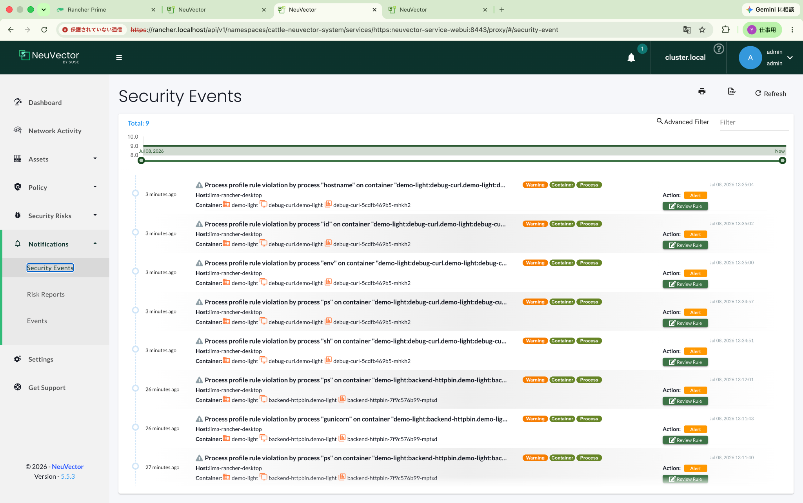
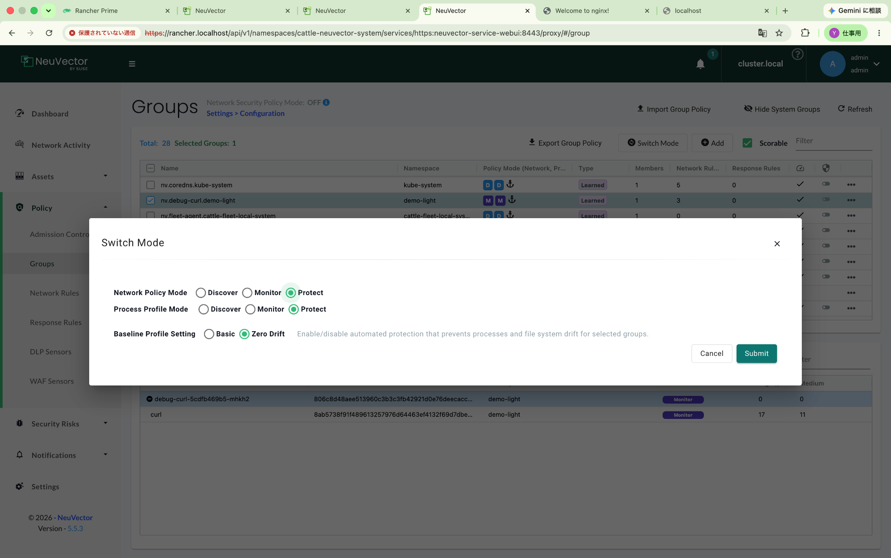
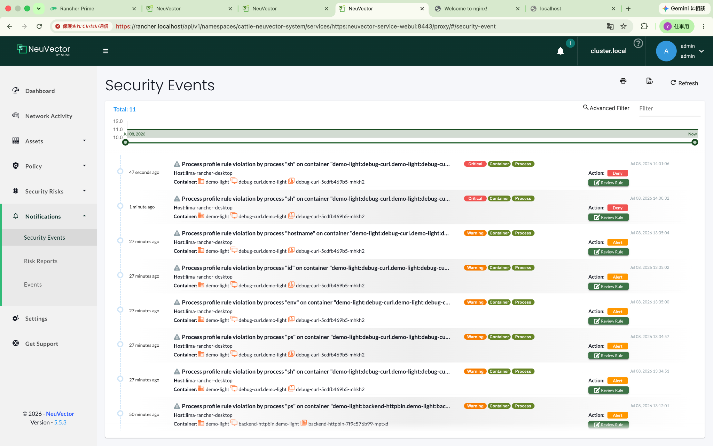
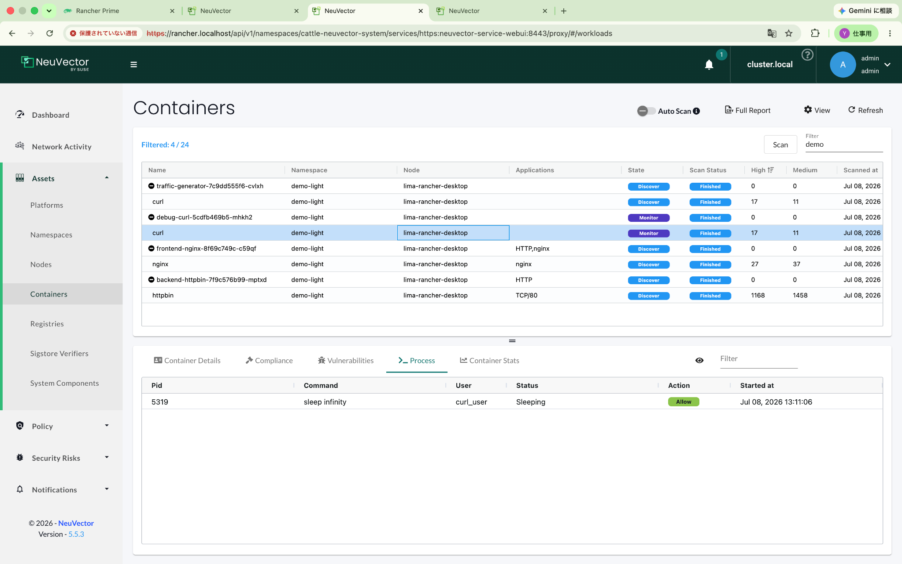
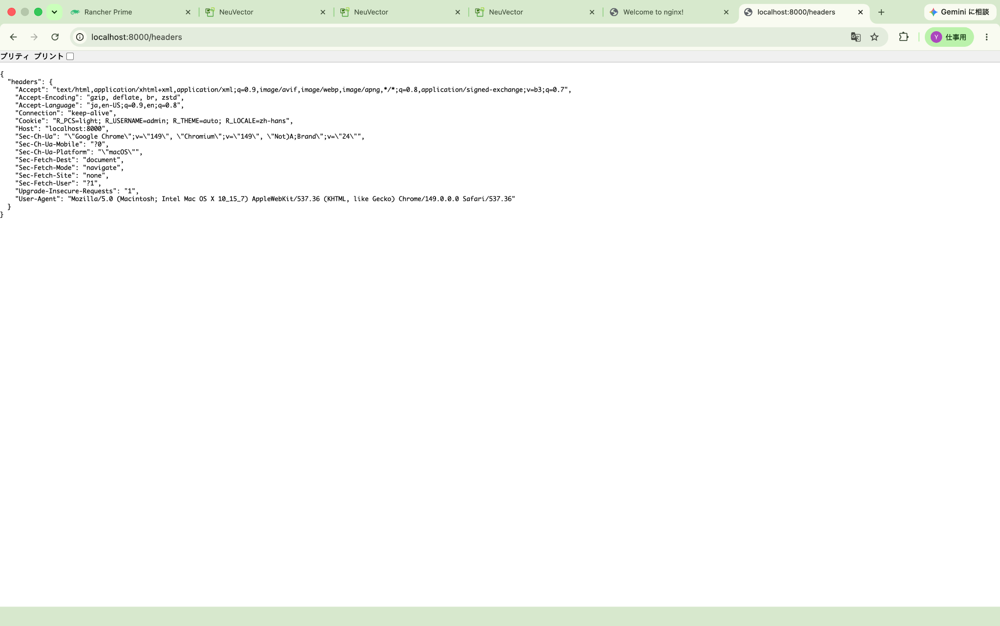

# NeuVector: Image Scan と Zero Trust ハンズオン

このドキュメントは、`rancher-prime-demo-workloads-light` を使って、NeuVector の基本機能である **スキャン** と **ゼロトラスト実行制御** を確認した記録です。

対象環境は Rancher Desktop 上の k3s です。

```text
kubectl context: rancher-desktop
node: lima-rancher-desktop
Kubernetes: v1.35.6+k3s1
NeuVector: 5.5.3
namespace: demo-light
```

## 1. この教材で見るもの

このハンズオンでは、次の2つを中心に確認します。

| 観点 | 内容 |
|---|---|
| Image Scan | コンテナイメージの脆弱性をスキャンし、High / Medium の件数を確認する |
| Zero Trust | Discovery → Monitor → Protect の流れで、通常動作を学習し、未知のプロセスを検知・拒否する |

ワークロードは以下です。

| ワークロード | 役割 |
|---|---|
| `frontend-nginx` | ブラウザや curl からアクセスするフロントエンド |
| `backend-httpbin` | HTTPリクエストを観察するためのバックエンド |
| `traffic-generator` | 継続的な正常トラフィックを発生させる |
| `debug-curl` | `kubectl exec` による手動検証用コンテナ |

## 2. デプロイと初期確認

```bash
kubectl apply -k k8s
kubectl get all -n demo-light
kubectl get pods -n demo-light -o wide
```

4つのPodが `Running` になれば成功です。

```text
backend-httpbin      Running
frontend-nginx       Running
debug-curl           Running
traffic-generator    Running
```

NeuVector の `Assets > Containers` では、`demo-light` の各コンテナが表示されます。



## 3. Network Activity / Service Map

`Network Activity` では、`debug-curl`、`traffic-generator`、`frontend-nginx`、`backend-httpbin` の関係が表示されます。



この時点で、NeuVector はワークロード間通信を観察できています。

## 4. Image Scan

`Assets > Containers` で対象コンテナを選択し、`Scan` を実行します。

スキャン後、`Scan Status` が `Finished` になり、High / Medium の件数が表示されます。



確認できた例:

| コンテナ | 結果例 |
|---|---|
| `curlimages/curl` | High / Medium の脆弱性が表示された |
| `nginx` | High / Medium の脆弱性が表示された |
| `httpbin` | 多数の脆弱性が表示された |

ここで重要なのは、**公開済みイメージでもスキャン対象になり、教材としてCVE確認ができる**ことです。

## 5. Discovery: 正常を学習する

`Policy > Groups` で `demo-light` のグループを確認します。



初期状態では、各グループの Policy Mode は `D / D`、つまり Network / Process ともに Discover です。

```text
D / D = Network: Discover, Process: Discover
```

Discovery では、NeuVector は通信やプロセスを学習します。まず数分程度、通常トラフィックを流します。

```bash
./scripts/generate-manual-traffic.sh
```

このスクリプトは `debug-curl` から以下へアクセスします。

```text
frontend-nginx
backend-httpbin /get
backend-httpbin /headers
```

## 6. Monitor: 異常を検知する

次に、`debug-curl` だけを Monitor にします。

`Policy > Groups > nv.debug-curl.demo-light > Switch Mode` を開きます。



設定:

```text
Network Policy Mode: Monitor
Process Profile Mode: Monitor
Baseline Profile Setting: Zero Drift
```

その後、`debug-curl` に入って手動操作します。

```bash
kubectl exec -it -n demo-light deploy/debug-curl -- sh
```

コンテナ内で実行した例:

```sh
ps
env
id
hostname
curl http://backend-httpbin:8000/get
curl http://frontend-nginx
exit
```

Monitor では、未知のプロセスは **ブロックされず、イベントとして記録** されます。



確認できたイベント例:

| プロセス | Action | 意味 |
|---|---|---|
| `sh` | Alert | 対話シェル起動を検知 |
| `ps` | Alert | 手動実行されたプロセスを検知 |
| `env` | Alert | 環境変数表示コマンドを検知 |
| `id` | Alert | ユーザー情報確認コマンドを検知 |
| `hostname` | Alert | ホスト名確認コマンドを検知 |

ここで大事なのは、**イベントが出たこと自体が攻撃を意味するわけではない**ことです。管理者操作なのか、想定外の侵入後操作なのかを判断する必要があります。

## 7. Protect: 未知のプロセスを拒否する

次に、`debug-curl` を Protect にします。



設定:

```text
Network Policy Mode: Protect
Process Profile Mode: Protect
Baseline Profile Setting: Zero Drift
```

まず正常通信を再確認します。

```bash
./scripts/generate-manual-traffic.sh
```

結果として、`frontend-nginx` と `backend-httpbin` への `curl` は成功しました。

次に、対話シェルを起動します。

```bash
kubectl exec -it -n demo-light deploy/debug-curl -- sh
```

結果:

```text
command terminated with exit code 137
```

NeuVector 側では、`sh` が `Deny` されています。



## 8. Protect モードでのコマンド実行結果

Protect にした後、単発コマンドを実行しました。

| コマンド | 結果 | 解釈 |
|---|---|---|
| `curl http://backend-httpbin:8000/get` | 許可 | 正常通信として許可 |
| `ps` | 許可 | 学習済みまたは許可済みプロセス |
| `env` | 許可 | 学習済みまたは許可済みプロセス |
| `hostname` | 許可 | 学習済みまたは許可済みプロセス |
| `id` | 拒否 | 未許可プロセスとして Deny |
| `sh` | 拒否 | 対話シェル起動として Deny |

実行例:

```bash
kubectl -n demo-light exec deploy/debug-curl -- ps
kubectl -n demo-light exec deploy/debug-curl -- env
kubectl -n demo-light exec deploy/debug-curl -- id
kubectl -n demo-light exec deploy/debug-curl -- hostname
kubectl -n demo-light exec deploy/debug-curl -- curl -sS http://backend-httpbin:8000/get
```

結果のポイント:

```text
kubectl exec -- sh      -> exit code 137
kubectl exec -- id      -> exit code 137
kubectl exec -- curl    -> succeeded
```

つまり、Protect は `kubectl exec` 全体を禁止するのではなく、**コンテナ内で起動されるプロセス単位で許可・拒否する**ことが分かります。

## 9. Discovery / Monitor / Protect の違い

| 操作 | Discovery | Monitor | Protect |
|---|---:|---:|---:|
| 正常通信 `curl` | 許可・学習 | 許可 | 許可 |
| 未知プロセス `sh` | 許可・学習 | Alert | Deny |
| 未知プロセス `id` | 許可・学習 | Alert | Deny |
| 学習済みプロセス `ps` | 許可・学習 | Alert または許可 | 許可される場合あり |
| イメージスキャン | 手動/自動で実行 | 同左 | 同左 |

この流れにより、NeuVector のゼロトラストは次のように理解できます。

```text
Discovery: 正常を学習する
Monitor: 正常から外れたものを記録する
Protect: 正常から外れたものを拒否する
```

## 10. httpbin の位置づけ

`backend-httpbin` は業務アプリではなく、HTTP通信を観察するための教材用バックエンドです。

ブラウザから確認できます。

```bash
kubectl -n demo-light port-forward svc/backend-httpbin 8000:8000
```

```text
http://localhost:8000
http://localhost:8000/get
http://localhost:8000/ip
http://localhost:8000/headers
http://localhost:8000/status/404
```

`/status/404` は「404を返す」ためのエンドポイントなので、Chromeでは「ページが見つかりません」と表示されます。これは仕様です。





## 11. まとめ

このハンズオンで確認できたこと:

- `demo-light` は NeuVector の教材ワークロードとして利用できる。
- Image Scan により、公開済みイメージのCVEを確認できる。
- Network Activity でワークロード間通信を可視化できる。
- Monitor では未知プロセスが Alert として記録される。
- Protect では未知プロセスが Deny される。
- Protect は `kubectl exec` 全体を禁止するのではなく、プロセス単位で制御する。
- `debug-curl` は手動検証用Podとして有効である。
- `httpbin` はHTTP挙動を観察する教材用バックエンドとして有効である。

次の改善候補:

- `frontend-nginx` を ConfigMap で差し替え、人が操作できるデモページにする。
- `frontend-nginx` から `backend-httpbin` へリバースプロキシし、ブラウザ操作で Pod 間通信を発生させる。
- 任意追加の `debug-toolbox` Pod を用意し、DNS / ICMP / TCP などの追加デモを可能にする。
